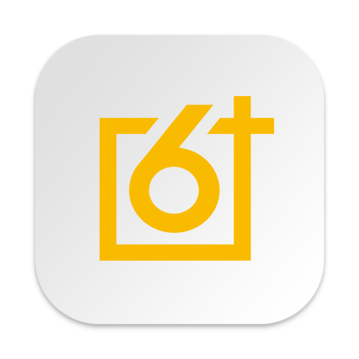

<p align="center">
  
</p>

<h1 align="center">GK6+ for Linux</h1>

<p align="center">
  <b>An unofficial port of the GK6+ application for Linux, enabling configuration of Skyloong keyboards on Linux systems</b>
</p>

<p align="center">
  <a href="#-about">About</a> •
  <a href="#-installation">Installation</a> •
  <a href="#-configuration">Configuration</a> •
  <a href="#-running-the-application">Running</a> •
  <a href="#-functionality">Functionality</a> •
  <a href="#-troubleshooting">Troubleshooting</a>
</p>

---

## 📋 About

The original GK6+ application is only available for Windows and macOS. This project provides an adapted version of the macOS application that works on Linux systems, allowing Linux users to fully configure their Skyloong keyboards.

### ✅ Successfully tested with:
- **Skyloong GK104 Pro**
- **Tested on Arch Linux**

## 🚀 Installation

### Prerequisites
- Node.js (tested with 23.9.0-1)
- npm (tested with 11.2.0-1)
- Electron (tested with 1:34-1 and electron34 34.3.2-1)

### Setup
1. Clone the repository:
```bash
git clone https://github.com/VladTop46/Skyloong-GK6Plus-Linux.git
cd app
```

2. Install npm dependencies:
```bash
npm install
```

## 🔧 Configuration

### Setting up USB device permissions
You need to configure access permissions for USB devices:

#### Temporary solution (until reboot)
```bash
sudo chmod 666 /dev/hidraw*
```

## 💻 Running the application
```bash
npm start
```

## 🛠️ Functionality

### Features
| Feature | Status |
|---------|--------|
| Keyboard detection | ✅ Tested, working |
| Macro configuration | ✅ Tested, working |
| RGB lighting customization | ⚠️ Not fully tested |
| Key mapping | ✅ Tested, working |

## 🔍 Troubleshooting

If the application doesn't recognize your keyboard, check:

1. Access rights to hidraw devices:
```bash
ls -la /dev/hidraw*
```

## 📜 License

<p align="center">
  This project is distributed under the MIT license, like the original application.
</p>

## ⚠️ Disclaimer

This is an unofficial port of the application. The authors are not affiliated with Skyloong and are not responsible for any hardware issues. Use at your own risk.

## 🤝 Contributions

Contributions to the project are welcome! If you want to improve this port or add support for other Skyloong keyboard models, feel free to create pull requests.

## 🙏 Acknowledgements

- The development team of the original GK6+ application
- Thanks in advance to everyone who will help test this port on different keyboards and systems